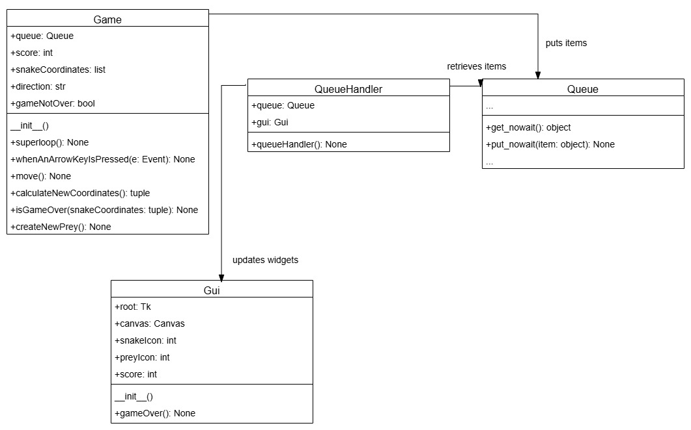
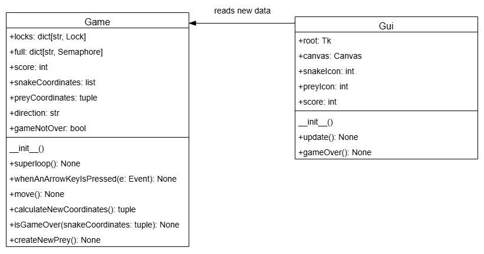

# Snake Game with Multithreading

## Contents

* [Overview](#Overview)
    * [Program Design](#Design)
* [Documentation](#Documentation)
    * [UML Relationships](#UML-Relationships)
* [Demonstration](#Demonstration)
* [Credit](#Credit)

## Overview

We developed the classic [Snake Game](https://en.wikipedia.org/wiki/Snake_(video_game_genre)) in a multithreaded **Python** application.

### Design

This was originally designed with the `Queue.queue()` class to achieve synchronization (i.e. *message passing*).

In our alternative implementation, we redesigned this with the
`threading.Lock()` and `threading.Semaphore()` classes (i.e. *memory sharing*)

## Documentation

Please review the extensive documentation in our report for the [Original Implementation](/Documentation/Original/Original.pdf), as well as the [Alternative Implementation](/Documentation/Alternative/Alternative.pdf)

### UML Relationships

We have illustrated the following **UML Class Diagrams** to describe the high-level interactions in our program.

<table>
  <tr>
    <th>Implementation</th>
    <th>Class Diagrams</th>
  </tr>
  <tr>
    <td>Original</td>
    <td></td>
  </tr>
  <tr>
    <td>Alternative</td>
    <td></td>
  </tr>
</table>

## Demonstration

We have uploaded our Final Demo on <a href="https://www.youtube.com/watch?v=Qz6d5o-q-Cc" target="_blank">Youtube</a>.

https://github.com/user-attachments/assets/b3679e9f-b17b-4178-85d7-6df08a808b2d

## Credit

This was completed as part of the <b>CPEN 333 - Software Design</b> course in the <b>The University of British Columbia Electrical and Computer Engineering</b> undergraduate program. We received tremendous support and guidance from Dr. Farshid Agharebparast.
